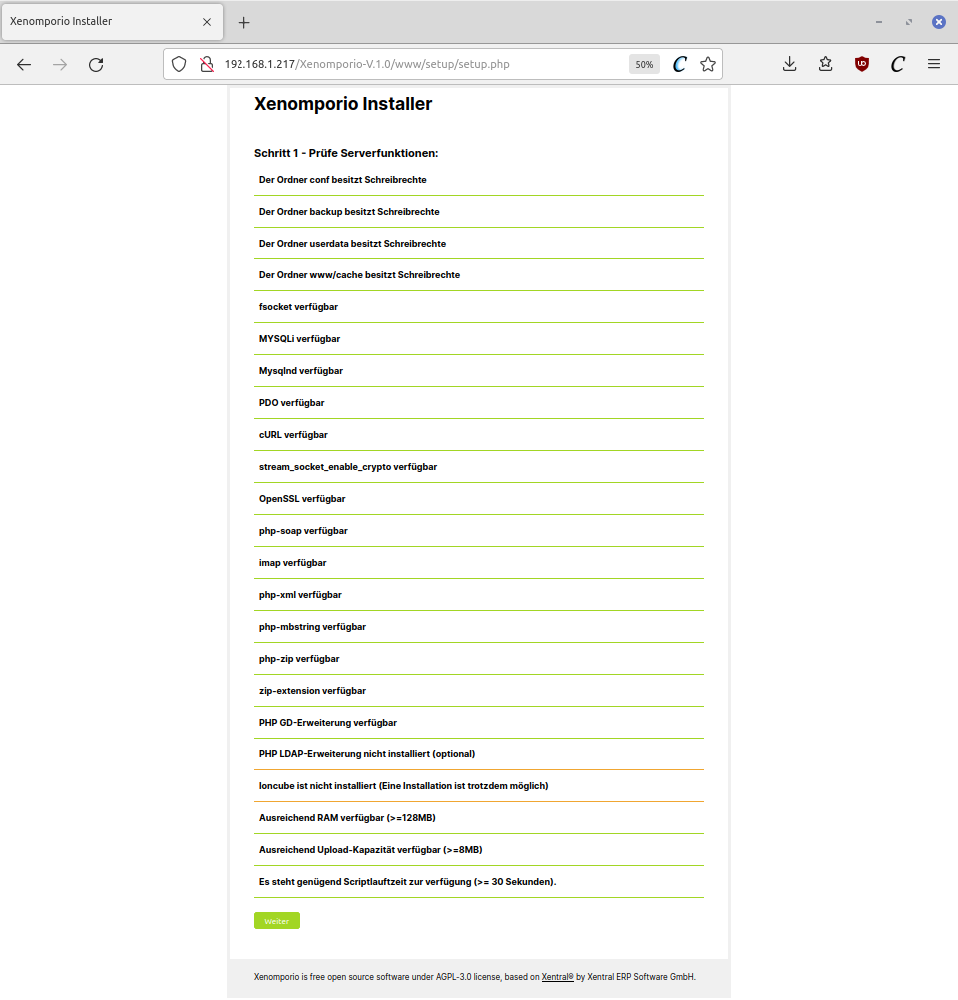
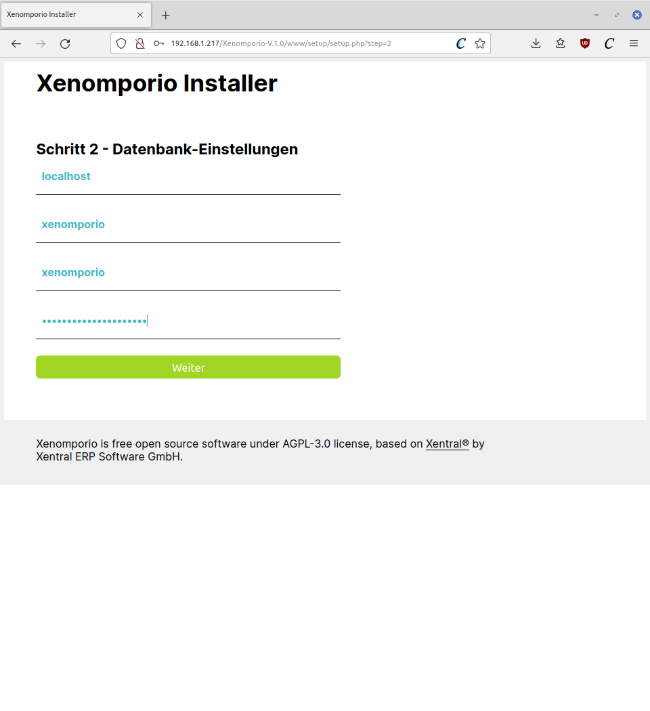
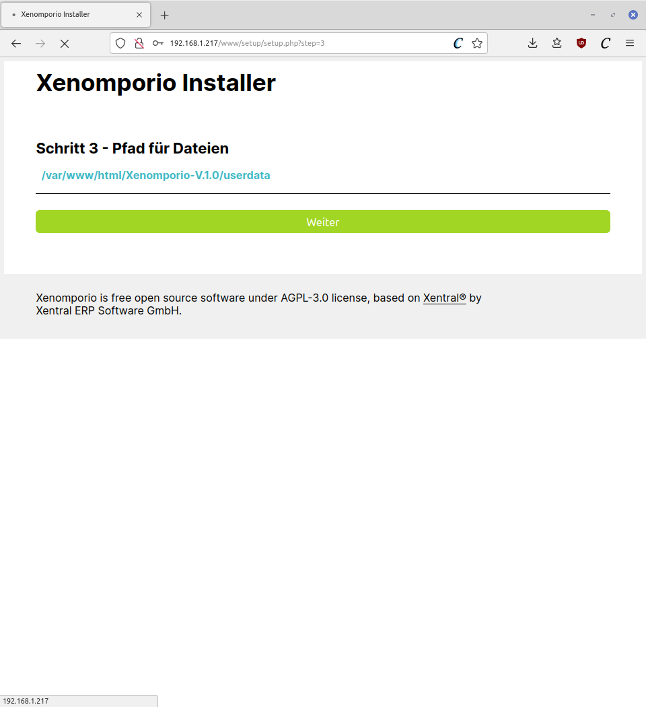
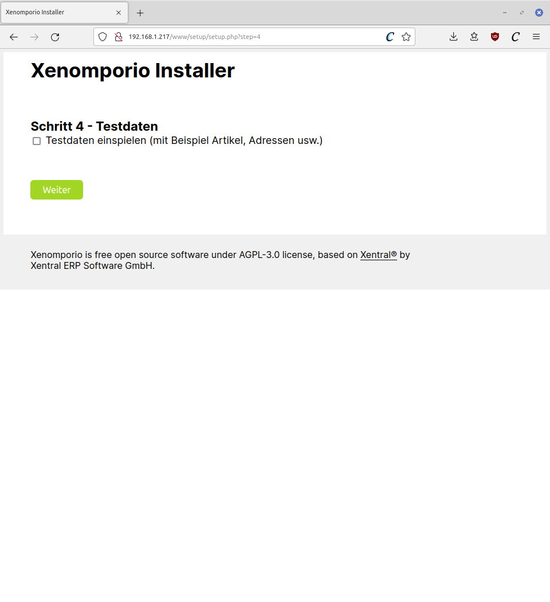
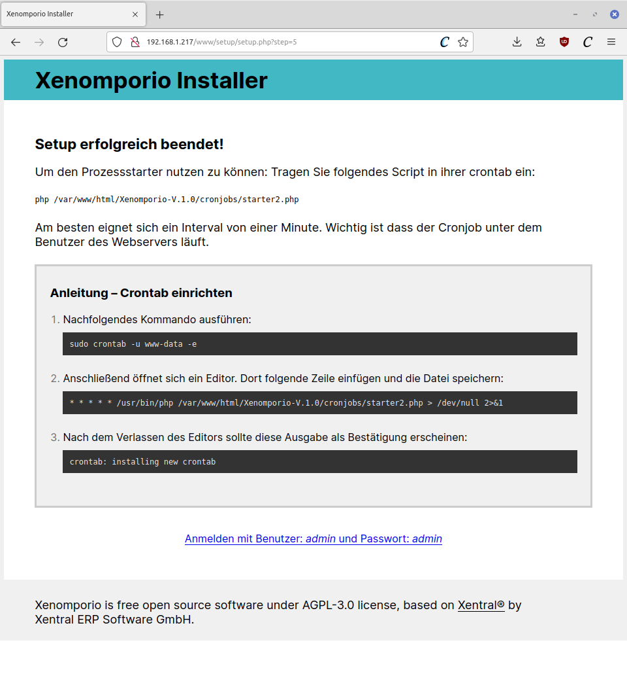
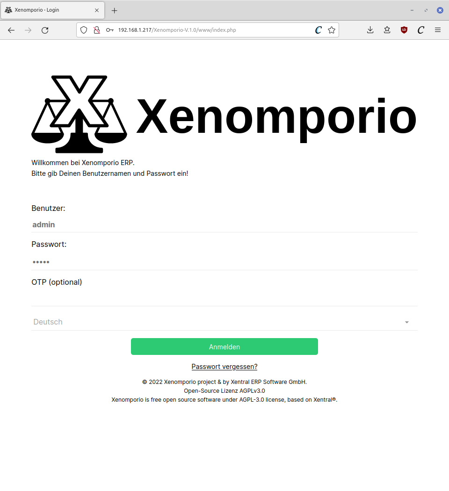
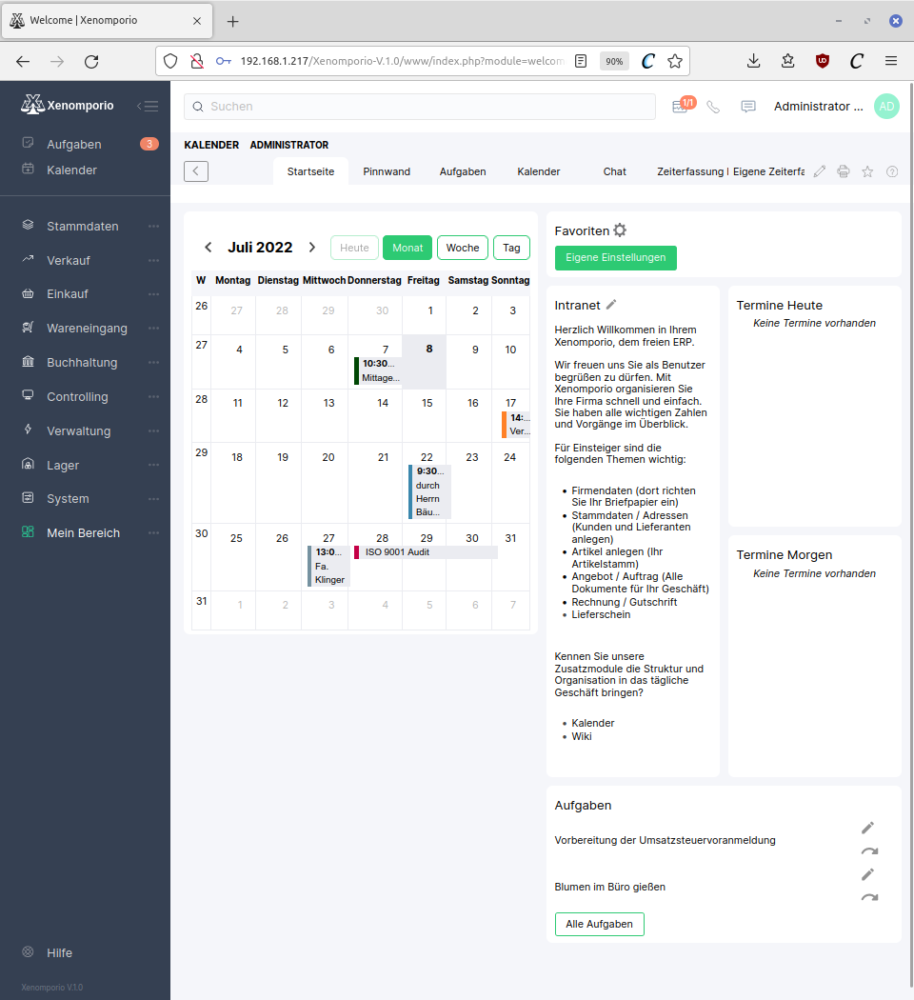

# OpenXE installation

## Place the installation files into a folder in /var/www/html/.

`cd /var/www/html`

e.g. Release 1.0:

`sudo wget https://github.com/openxe-org/OpenXE/archive/refs/tags/V.1.0.zip`

`unzip V.1.0.zip`

## Set folder permissions:

`sudo chown www-data:www-data OpenXE-V.1.0 -R`

## Fire up the setup page in a browser

http://yourserverip/OpenXE-V.1.0 (watch out, its case sensitive)

